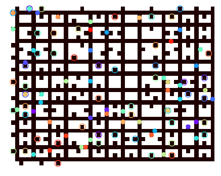
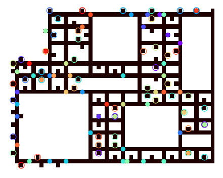
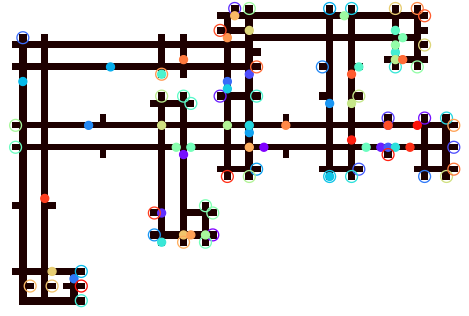
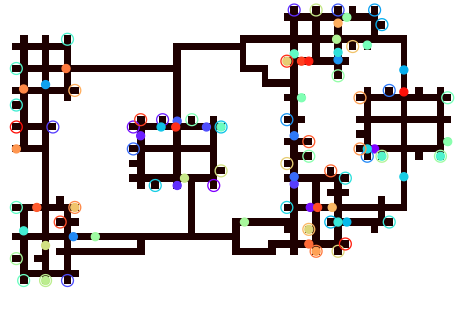

# SADG Controller

Implementation of the 
  Switchable Action Dependency Graph (SADG) 
  receding horizon controller (RHC) feedback scheme
  presented in

> A. Berndt, N. van Duijkeren, L. Palmieri, A. Kleiner, T. Keviczky, "Receding Horizon Re-ordering of Multi-Agent Execution Schedules", in _Transactions of Robotics_.

Receding Horizon Feedback Control Scheme |
:-------------------------:|

_Our approach significantly reduces the cumulative route completion of AGVs subjected to large delays by optimizing the ordering of AGVs based on their progress in a receding horizon fashion, while maintaining collision- and deadlock-free plan execution guarantees._ |

Full Maze             |  Half Maze |  Warehouse |  Islands
:-------------------------:|:-------------------------:|:-------------------------:|:-------------------------:
  |   |  | 


## Get Started

First, make sure you have installed:

- [Poetry](https://python-poetry.org/docs/) for consistent python dependency management
- [ROS noetic](http://wiki.ros.org/noetic/Installation/Ubuntu) for asynchronous inter-agent communication

```bash
git clone --recurse-submodules git@github.com:alexberndt/sadg-controller.git
cd sadg-controller
poetry install
```

### Install libMultiRobotPlanning

> The [libMultiRobotPlanning](https://github.com/whoenig/libMultiRobotPlanning) contains `MAPF` planners such as `CBS` and `ECBS` used by the SADG feedback scheme, and is therefore a `third-party` dependency for this repository.

Install build dependencies

```bash
sudo apt-get install g++ cmake libboost-program-options-dev \
libyaml-cpp-dev clang-tidy  clang-format doxygen
```

Compile from source
```bash
cd third_party/libMultiRobotPlanning/
mkdir build
cd build
cmake ..
make
```
