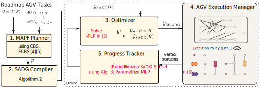
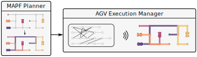
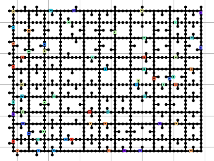
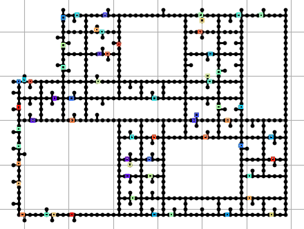
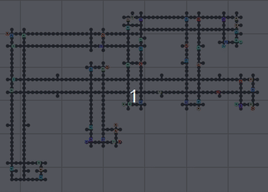
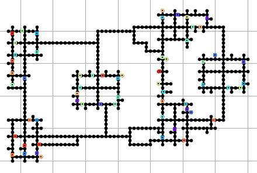

# SADG Controller

SADG-controller is a Python-library
  containing an implementation of the
  Switchable Action Dependency Graph (SADG)
  receding horizon controller (RHC) feedback scheme
  presented in

> A. Berndt, N. van Duijkeren, L. Palmieri, A. Kleiner, T. Keviczky, "Receding Horizon Re-ordering of Multi-Agent Execution Schedules", currently under review for publication in _Transactions of Robotics_.

SADG Receding Horizon Feedback Control Scheme | Typical MAPF Execution Schemes |
:-------------------------:|:-------------------------:|
|  |

_Our approach significantly reduces the cumulative route completion of agents subjected to large delays by optimizing the ordering of agents based on their progress in a receding horizon fashion, while maintaining collision- and deadlock-free plan execution guarantees._

## List of Functionalities

1. Python-based interface for interacting with MAPF planners from [libMultiRobotPlanning](https://github.com/whoenig/libMultiRobotPlanning)
2. SADG Receding Horizon feedback control scheme implementation

## Installation Instructions

### Install Dependencies

First, ensure you have:

- [Poetry](https://python-poetry.org/docs/master/#installing-with-the-official-installer) for consistent python dependency management.
- [ROS noetic](http://wiki.ros.org/noetic/Installation/Ubuntu) for asynchronous inter-agent communication.
- Linux `apt-get` packages: `g++`, `cmake`, `libboost-program-options-dev`, `libyaml-cpp-dev`, `clang-tidy`, `clang-format`, `doxygen`.

### Clone Repository

```bash
git clone --recurse-submodules git@github.com:alexberndt/sadg-controller.git
cd sadg-controller
make
```

> This repository contains [libMultiRobotPlanning](https://github.com/whoenig/libMultiRobotPlanning) in [third_party/](third_party/libMultiRobotPlanning/), a library which contains `MAPF` planners such as `CBS` and `ECBS` used by the SADG feedback scheme. libMultiRobotPlanning is compiled from source when running `make`.

### Build the ROS Packge

```bash
catkin_make
```

## Examples

To start a simulation, run the following

#### Terminal 1: Initialize the Agents
```bash
source devel/setup.zsh
roslaunch launch/8/agents.launch
```

#### Terminal 2: Start the Controller
```bash
source devel/setup.zsh
roslaunch launch/8/controller.launch
```

#### Terminal 3: Visualize the Plan Execution
```bash
source devel/setup.zsh
roslaunch launch/8/simulation.launch
```

<!-- #### Terminal 4: Visualize the SADG
```bash
source devel/setup.zsh
roslaunch launch/8/sadg.launch
``` -->

Full Maze             |  Half Maze |  Warehouse |  Islands
:-------------------------:|:-------------------------:|:-------------------------:|:-------------------------:
  |   |  | 

## Contribute

To contribute to this repository, set up your development environment as follows

1. Follow the [installation instructions](#installation-instruction)
2. Set up pre-commit hooks:
    ```bash
    poetry run pre-commit install
    ```
