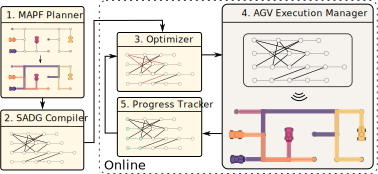
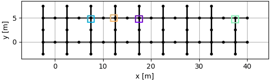

# SADG Controller

sadg-controller is a Python-library
  containing an implementation of the
  Switchable Action Dependency Graph (SADG)
  receding horizon controller (RHC) feedback scheme
  presented in:

> A. Berndt, N. van Duijkeren, L. Palmieri, A. Kleiner, T. Keviczky, "Receding Horizon Re-ordering of Multi-Agent Execution Schedules," to appear in _Transactions on Robotics_.

SADG Receding Horizon Feedback Control Scheme | Typical MAPF Execution Schemes |
:-------------------------:|:-------------------------:|
|  |

_Our approach significantly reduces the cumulative route completion of agents subjected to large delays by optimizing the ordering of agents based on their progress in a receding horizon fashion, while maintaining collision- and deadlock-free plan execution guarantees._

 Switchable Action Dependency Graph | Roadmap |
:-------------------------:|:-------------------------:|
 |  |

## Purpose of the Project

This software is a research prototype, solely developed for and published as part of the publication cited above. It is not foreseen to be either actively maintained or monitored in any way.

## List of Functionalities

1. Python-based interface for interacting with MAPF planners from [libMultiRobotPlanning](https://github.com/whoenig/libMultiRobotPlanning)
2. SADG Receding Horizon feedback control scheme implementation

## Install with Docker

The most straightforward way to get started is using Docker. This way, you can use the software in Ubuntu, Windows and Mac. To this end first install [Docker](https://docs.docker.com/engine/install/).

Then, build the image:
```bash
docker build -t sadg-controller .
```

Subsequently, you can run the image:
```bash
xhost +  # only for system running an X server 
docker run --rm -it -e DISPLAY=$DISPLAY -v /tmp/.X11-unix:/tmp/.X11-unix:ro sadg-controller bash;
xhost -  # only for system running an X server
```

From inside the image you can follow the instructions in the [Examples](#examples) section.

## Install without Docker

Before proceeding, consider using the [Docker-based approach](#install-with-docker).
We present here the typical ROS2-based installation approach that will also prepare the dependency [`libMultiRobotPlanning`](https://github.com/whoenig/libMultiRobotPlanning) automatically.

### Install ROS2

We currently support the following version of ROS2:
- [ROS Galactic](https://docs.ros.org/en/galactic/Installation.html) for Ubuntu 20.04
- [ROS Humble](https://docs.ros.org/en/humble/Installation.html) for Ubuntu 22.04

Make sure to install `colcon` and `rosdep`:
```bash
sudo apt install python3-rosdep python3-colcon-common-extensions
sudo rosdep init
rosdep update
```

### Prepare workspace
Create a workspace (e.g., in your home folder) and clone `sadg-controller`.
```bash
mkdir -p ~/sadg_ws/src
cd ~/sadg_ws/src
git clone --recurse-submodules git@github.com:<organization>/<repository>.git
cd ~/sadg_ws
```

### Install dependencies
Then, from `~/sadg_ws`, execute:
```bash
rosdep install --from-paths src --ignore-src -r -y
```

Install python dependencies:
```bash
/usr/bin/python3 -m pip install -r src/sadg-controller/requirements.txt
```

### Build workspace
From `~/sadg_ws`, execute:
```bash
colcon build --symlink-install  # --symlink-install is optional
```

## Examples

To start a simulation, run the following

```bash
source install/setup.bash
ros2 launch sadg_controller scenario.launch.xml agent_count:=8 roadmap:=test visualize_sadg:=True
```

More generally, one can start scenarios by

```bash
source install/setup.bash
ros2 launch sadg_controller scenario.launch.xml agent_count:=<number of agents> roadmap:={test, cover, full_maze, half_maze, islands, warehouse} ecbs_sub_factor:=<ecbs suboptimality factor> visualize_sadg:={True, False}
```

It is also possible to start the agent nodes, simulator and controller separately using the launch files:
* `ros2 sadg_controller agents.launch.py agent_count:=...`
* `ros2 sadg_controller simulation.launch.py agent_count:=... roadmap:=...`
* `ros2 sadg_controller controller.launch.py agent_count:=... roadmap:=... ecbs_sub_factor:=... visualize_sadg:=...`

The controller generates random start and goal points, which may cause issues in certain configurations. Some configurations that we have managed to run relatively reliably can be found in the table below, note that the limitation here is in fact the randomness (which may be fixed). 

| `roadmap`   | `agent_count` |
|-------------|---------------|
| `test`      | 2, 4, 8, 10   |
| `cover`     | 8             |
| `full_maze` | 60            |
| `half_maze` | 40            |
| `islands`   | 40            |
| `warehouse` | 40, 60        |

#### Example Results

Full Maze             |  Half Maze |  Warehouse |  Islands
:-------------------------:|:-------------------------:|:-------------------------:|:-------------------------:
  |   |  | 

## About

### Maintainers

- [Alex Berndt](https://github.com/alexberndt)
- [Niels van Duijkeren](https://github.com/nielsvd)

### 3rd Party Licenses

Details about the 3rd party licenses can be found in [3rd-party-licenses.txt](./3rd-party-licenses.txt). In short, this repository contains a submodule for the library [libMultiRobotPlanning](https://github.com/whoenig/libMultiRobotPlanning), which comes under the MIT license.

### License

sadg-controller comes under the GNU Affero General Public License, Version 3, see [LICENSE](./LICENSE).
