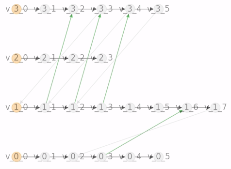

# SADG Controller

sadg-controller is a Python-library
  containing an implementation of the
  Switchable Action Dependency Graph (SADG)
  receding horizon controller (RHC) feedback scheme
  presented in:

> A. Berndt, N. van Duijkeren, L. Palmieri, A. Kleiner, T. Keviczky, "Receding Horizon Re-ordering of Multi-Agent Execution Schedules," to appear in _Transactions on Robotics_.

SADG Receding Horizon Feedback Control Scheme | Typical MAPF Execution Schemes |
:-------------------------:|:-------------------------:|
|  |

_Our approach significantly reduces the cumulative route completion of agents subjected to large delays by optimizing the ordering of agents based on their progress in a receding horizon fashion, while maintaining collision- and deadlock-free plan execution guarantees._

 Switchable Action Dependency Graph | Roadmap |
:-------------------------:|:-------------------------:|
 |  |

## List of Functionalities

1. Python-based interface for interacting with MAPF planners from [libMultiRobotPlanning](https://github.com/whoenig/libMultiRobotPlanning)
2. SADG Receding Horizon feedback control scheme implementation

## Installation Instructions

This repository supports several workflows to build and execute the software.
We present here the typical ROS2 approach that will also prepare the dependency [`libMultiRobotPlanning`](https://github.com/whoenig/libMultiRobotPlanning) automatically.

### Install ROS2

We currently support the following version of ROS2:
- [ROS Galactic](https://docs.ros.org/en/galactic/Installation.html) for Ubuntu 20.04
- [ROS Humble](https://docs.ros.org/en/humble/Installation.html) for Ubuntu 22.04

Make sure to install `colcon` and `rosdep`:
```bash
sudo apt install python3-rosdep python3-colcon-common-extensions
sudo rosdep init
rosdep update
```

### Prepare workspace
*FOR TRo REVIEWERS: unzip the attached workspace and navigate to it using `cd`.*
*Subsequently, initialize the submodules by:*
```bash
git submodule update --init --recursive
```

*FOR TRo REVIEWERS: the remainder of this section is currently not relevant.*

Create a workspace (e.g., in your home folder) and clone `sadg-controller`.
```bash
mkdir -p ~/sadg_ws/src
cd ~/sadg_ws/src
git clone --recurse-submodules git@github.com:<organization>/<repository>.git
cd ~/sadg_ws
```

### Install dependencies
Then, from `~/sadg_ws`, execute:
```bash
rosdep install --from-paths src --ignore-src -r -y
```

Install python dependencies:
```bash
/usr/bin/python3 -m pip install -r src/sadg-controller/requirements.txt
```

### Build workspace
From `~/sadg_ws`, execute:
```bash
colcon build --symlink-install  # --symlink-install is optional
```

## Examples

To start a simulation, run the following

#### Terminal 1: Initialize the Agents
```bash
source install/setup.bash
ros2 launch sadg_controller n8_agents.launch.xml
```

#### Terminal 2: Visualize the Plan Execution
```bash
source install/setup.bash
ros2 launch sadg_controller n8_simulation.launch.xml
```

#### Terminal 3: Start the Controller
```bash
source install/setup.bash
ros2 launch sadg_controller n8_controller.launch.xml
```

<!-- #### Terminal 4: Visualize the SADG
```bash
source devel/setup.sh
roslaunch launch/8/sadg.launch
``` -->

Full Maze             |  Half Maze |  Warehouse |  Islands
:-------------------------:|:-------------------------:|:-------------------------:|:-------------------------:
  |   |  | 

## About

### Maintainers

- [Alex Berndt](https://github.com/alexberndt)

### Contributors

... are welcome at any time and will be listed here.

- [Niels van Duijkeren](https://github.com/nielsvd)

### 3rd Party Licenses

This repository contains a submodule for the library [libMultiRobotPlanning](https://github.com/whoenig/libMultiRobotPlanning),
which comes under the MIT license.

### License

sadg-controller comes under the GNU Affero General Public License, Version 3, see [LICENSE](./LICENSE).
